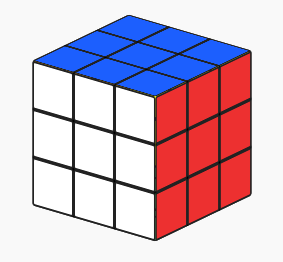
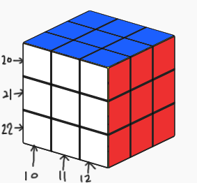

# 024. 魔術方塊

有一魔術方塊有六面，一開始白色朝自己，藍色朝上，紅色朝右
立體示意圖如連結所示，

展開示意圖如連結所示，

顏色編號，1: 藍色，2: 紅色，3: 黃色，4: 白色，5: 橘色，6:綠色。

魔術方塊的操作：
10 表示直欄(column)最左邊向前轉一次。
11 表示直欄(column)中間向前轉一次。
12 表示直欄(column)最右邊向前轉一次。
20 表示橫列(row)最上面向左轉一次。
21 表示橫列(row)中間向左轉一次。
22 表示橫列(row)最下面向左轉一次。
註：以上修改操作，皆不會轉動魔術方塊的本體，只會針對欄或列做操作
示意圖如連結所示

向前轉：即對於紅色面為順時針旋轉方向
向左轉：即對於藍色面為順時針旋轉方向

經過 M 次操作後，輸出魔術方塊「面向自己」(即原始白色面) 顏色編號。

【輸入說明】
第一行，輸入一整數 M，代表魔術方塊的操作次數，
其後 M 行，每一行輸入一整數，代表魔術方塊的操作方式。

範例輸入說明:
2 (接下來會有 2 次修改操作)
10 (表示直欄最左邊向前轉一次)
20 (表示橫列最上面向左轉一次)

經過10操作後魔術方塊顏色編號為：
6 4 4
6 4 4
6 4 4

經過20操作後魔術方塊顏色編號為：
2 2 2
6 4 4
6 4 4

【輸出說明】
經過 M 次操作後，輸出「面向自己」 9 格的顏色編號。
註：row 的數字間以一個空格區隔

範例輸出說明:
2 2 2
6 4 4
6 4 4

【測試資料一】
輸入：
2
10
12

輸出：
6 4 6
6 4 6
6 4 6

【測試資料二】
輸入：
4
21
21
10
21

輸出：
6 4 4
5 5 5
6 4 4

【測試資料三】
輸入：
6
20
10
10
20
21
21

輸出：
3 3 3
3 3 4
5 4 4

【測試資料四】
輸入：
8
10
20
10
20
10
22
21
11

輸出：
1 6 1
2 6 2
2 1 2